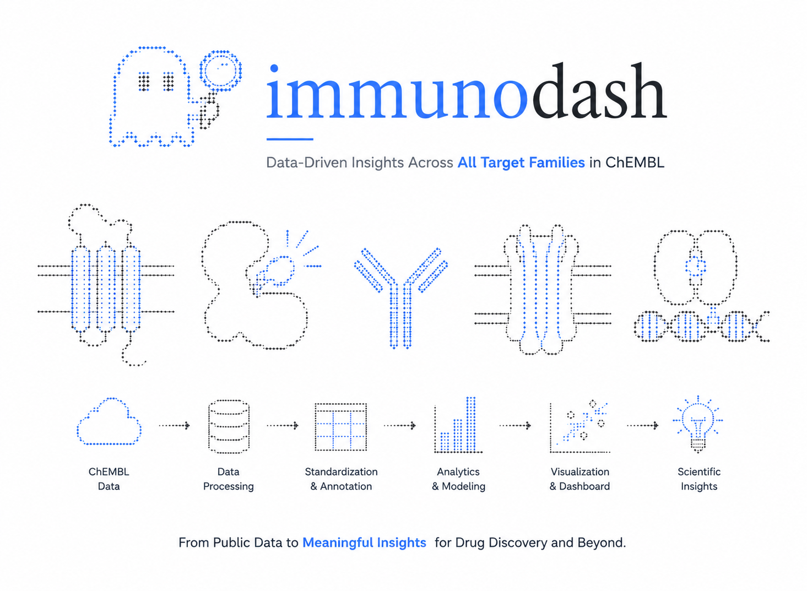

<p align="center">
  
</p>

# 👻 immunodash

> **Data-Driven insights across all target families in chEMBL**

<p align="center">
  
</p>

> From public bioactivity data to interactive scientific insights.
---

## Overview

immunodash is an open-source biomedical analytics platform designed to transform raw ChEMBL data into interactive, interpretable scientific insights.

The project combines data engineering, bioinformatics, cheminformatics, and interactive visualization to enable exploration of bioactivity data across the entire drug discovery landscape.

Rather than focusing on a single protein family or disease area, ImmunoDash provides a unified framework for exploring all ChEMBL target families, helping researchers identify trends, compare therapeutic areas, investigate target classes, and generate hypothesis-driven insights.

The platform aims to bridge the gap between public pharmacological databases and modern scientific decision making through reproducible analytics and intuitive dashboards.

---

## Features

### Data pipeline

- Download and process ChEMBL datasets
- Automated ETL workflow
- Data cleaning and normalization
- Identifier harmonization
- Annotation enrichment
- Reproducible preprocessing

---

### Scientific analytics

Explore data by:

- Target family
- Target class
- Organism
- Disease area
- Molecule type
- Assay type
- Bioactivity
- Drug status
- Therapeutic area

Generate:

- Statistical summaries
- Distribution analyses
- Comparative analyses
- Trend analyses
- Interactive filtering

---

### Interactive dashboards

Built using Plotly Dash.

Includes:

- Dynamic filtering
- Interactive charts
- Linked visualizations
- Responsive layout
- Downloadable figures
- Search functionality

---

### Data visualization

Visual components include:

- Bar charts
- Pie charts
- Histograms
- Heatmaps
- Scatter plots
- Sankey diagrams
- Sunburst charts
- Treemaps
- Time-series analyses
- Correlation matrices

---

## Scientific workflow

```text
          ChEMBL
             │
             ▼
     Data Extraction
             │
             ▼
     Data Processing
             │
             ▼
 Standardization & Annotation
             │
             ▼
   Analytics & Modeling
             │
             ▼
 Interactive Dashboard
             │
             ▼
   Scientific Insights
```

---

## Project structure

```
ImmunoDash/
│
├── data/
│   ├── raw/
│   ├── processed/
│   └── annotations/
│
├── notebooks/
│
├── dashboard/
│
├── src/
│   ├── preprocessing/
│   ├── analytics/
│   ├── visualization/
│   ├── utils/
│   └── database/
│
├── assets/
│
├── docs/
│
├── app.py
├── requirements.txt
├── pyproject.toml
└── README.md
```

---

## Technologies

### Programming

- Python

### Data analysis

- Pandas
- NumPy

### Visualization

- Plotly
- Dash
- Plotly Express

### Data processing

- ChEMBL Web Resource Client
- Requests

### Development

- Git
- GitHub

---

## Example applications

ImmunoDash can support:

- Drug discovery research
- Medical Affairs
- Competitive intelligence
- Portfolio exploration
- Target landscape analysis
- Scientific communication
- Translational research
- Exploratory data analysis
- Public database exploration

---

## Current development

Current modules include:

- Data ingestion
- Data preprocessing
- Annotation pipeline
- Interactive dashboard
- Multi-target analytics
- Scientific visualization

Planned additions:

- Similarity analysis
- Network visualization
- Target prioritization
- Machine learning modules
- AI-assisted insight generation
- Exportable reports
- User authentication
- API endpoints

---

## Installation

Clone the repository:

```bash
git clone https://github.com/yourusername/immunodash.git
```

Move into the project:

```bash
cd immunodash
```

Create a virtual environment:

```bash
python -m venv .venv
```

Activate it.

Install dependencies:

```bash
pip install -r requirements.txt
```

Run the dashboard:

```bash
python app.py
```

---

## Design philosophy

immunodash was designed around four principles:

- Reproducibility
- Transparency
- Scientific usability
- Interactive exploration

Instead of producing static reports, the platform enables users to explore biomedical data dynamically and discover relationships through visual analytics.

---

## Skills demonstrated

This project demonstrates experience in:

- Biomedical Data Analytics
- Data Engineering
- ETL Pipelines
- Scientific Data Visualization
- Dashboard Development
- Python Programming
- Data Cleaning
- Data Standardization
- Scientific Communication
- Drug Discovery
- Bioinformatics
- Cheminformatics
- Open Biomedical Databases
- Reproducible Research

---

## Data source

This project uses publicly available data from:

**ChEMBL**

A manually curated database of bioactive molecules with drug-like properties maintained by EMBL-EBI.

https://www.ebi.ac.uk/chembl/

---

## Author

Rebecca Sessa

MSc Pharmaceutical Biotechnology

Interested in:

- Medical Affairs
- Biomedical Data Science
- Scientific Analytics
- Drug Discovery
- Digital Health